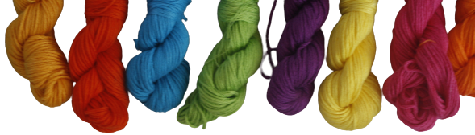

.

# What Floss is this?
Sandra Hernández

Data Anlytics Full Time, October-December 2022

## Overview

There are 500 colors of embroidery floss available in the catalogue of DMC, the most widely known brand around the world, and a project can require from a handful of colors up to more than a hundred.

From personal experience and from questions frequently posted around the web, identifying floss colors can be a complicated affair. Thats why I developed this app to help crafters find the DMC color code of a floss by uploading an image file or taking a picture.

By applying unsupervised machine learning and K-means clustering, the model is able to detect the colors in the image and then calculate its corresponding color from the database, by computing the euclidean distances between two colors.

## Technologies and tools used
- Python
- Jupyter Notebook
- Beautiful Soup
- Pandas
- Numpy
- Tableau
- SciKit-learn
- OpenCV

## Model Training and Evaluation

The information obtained through webscrapping included the color codes of the threads as well as the hexcode of each color.

When I used this information to train the model, I realized that the images used were already processed and that resulted in an inaccurate comparison to the pictures uploaded through OpenCV.

I then started a new process to get the hexcodes from pictures taken by me and processed directly in OpenCV and that's the reason why ths version of the model only recognizes a few DMC colors.

## Next steps

I have plans to expand the database to include more DMC colors to be recognized, with the goal to get the 489 available in the US and Mexico.

The light conditions ocurring when the photo of a mistery floss is taken impact the prediction results, so I would like to implement histogram matching with Open CV, Python and scikit-image, by asking the user to take a picture of a known color thread, comparing it with a reference photo already in the program and take those results into account to adjust the results of the model.

There are already a few more capabilities included in this project that could be useful for crafters and only need a user interface, for example:

- Extract a color palette with DMC color codes from a pícture
- Discover which floss colors to use to create a monocromatic palette or a complementary one
- Floss substitution

## Conclusion

The fact that a model is as good as the data you use to train it can't be ignored because the results will be impacted. It is also important to keep in mind that data analytics can and should be applied to a wide range of topics and disciplines because every one can get something of applying this technologies.

